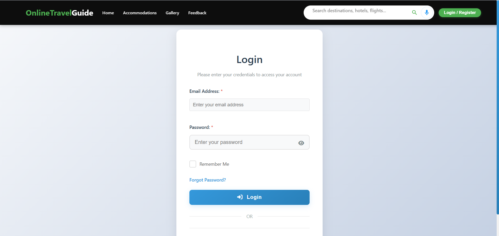
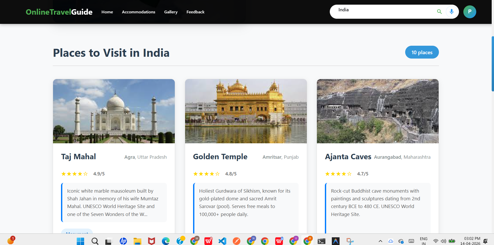
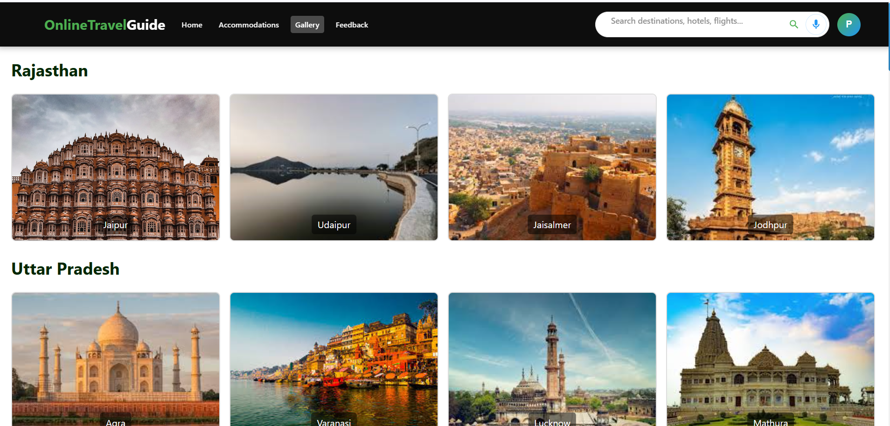
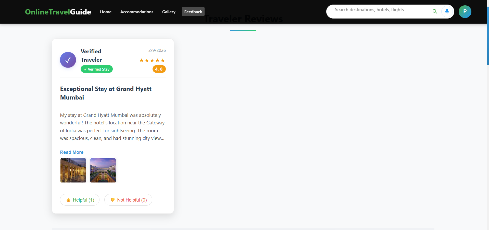
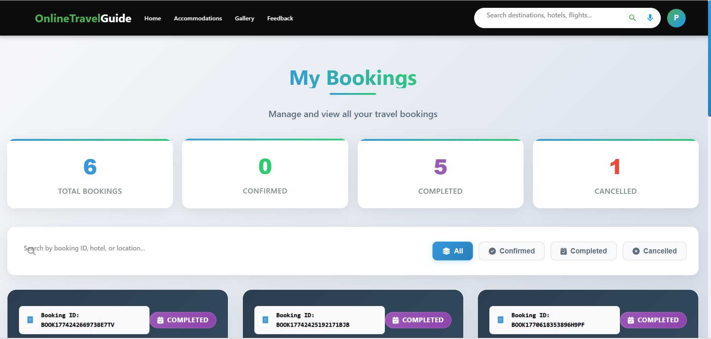

# Online Travel Guide

A sophisticated travel destination discovery and hotel booking platform that enables users to explore locations, book accommodations, and share verified feedback using advanced mapping and data analysis services.

## Key Features

### Authentication & Authorization
- Secure login and registration with JWT-based authentication.
- Role-based access control for Users and Administrators.
- OTP-verified account creation and password recovery.
- Professional profile management.

### Destination Discovery
- Multi-source search using Nominatim and Overpass API (OpenStreetMap).
- Voice-Enabled Search: Integrated voice recognition for hands-free destination and hotel discovery.
- Detailed place descriptions fetched via Wikipedia API.
- Search by landmarks, cities, or specific categories (hotels, resorts, attractions).
- Dynamic location suggestions and auto-complete functionality.

### Accommodation Booking
- Real-time hotel search near specific landmarks or within cities.
- Automated booking status management (Confirmed, Pending, Completed, Cancelled).
- Verified stay verification system linked to user feedback.
- Detailed pricing and amenity information.

### Feedback & Review System
- Post-checkout automated feedback request emails via Node-cron.
- Review submission with multi-photo upload support (Multer).
- Interactive voting system (Helpful/Not Helpful) on user reviews.
- Verified review badges for users with confirmed bookings.

---

## Screenshots

### Home Page


### Login Page


### Accommodation Page


### Search Page


### Gallery Page


### Feedback Page


### My Bookings Page


---

## Technology Used

### Frontend
- React 18+ – Modern UI library
- React Router – Client-side routing
- Context API – State management
- Tailwind CSS – Aesthetic styling and utility-first layouts
- Lucide React – Professional iconography
- React Speech Recognition – Voice-to-text integration for search query input.

### Backend
- Node.js – JavaScript runtime
- Express.js – Robust web framework
- MongoDB – NoSQL database with Mongoose ODM
- JWT – Secure token-based authentication
- Node-cron – Automated scheduling for feedback emails

### External APIs & Services
- Wikipedia API – Integration for destination summaries and historical data.
- OSRM (Open Source Routing Machine) – Backend routing engine for calculating stay distances and paths.
- Nominatim – Geocoding and reverse geocoding service.
- Overpass API – Advanced spatial data queries for nearby hotels and attractions.
- Nodemailer – Automated transactional email service.
- Multer – Middleware for handling multi-part/form-data for review photos.

---

## Prerequisites

- Node.js v18+
- MongoDB (Local instance or MongoDB Atlas)
- Git
- SMTP credentials (e.g., Gmail App Passwords) for automated emails

---

## Project Structure
```bash
Online-Travel-Guide/
│
├── frontend/
│   ├── src/
│   │   ├── components/      # Reusable UI components
│   │   ├── pages/           # Application views (Home, Search, Booking)
│   │   ├── services/        # API communication logic
│   │   └── App.jsx          # Main application entry
│   ├── public/              # Static assets
│   └── package.json
│
├── backend/
│   ├── models/              # Mongoose schemas (User, Booking, Feedback)
│   ├── routes/              # API endpoints (Auth, Hotel, Search, Admin)
│   ├── controllers/         # Business logic for requests
│   ├── middleware/          # Auth and error handling
│   ├── utils/               # Helpers (Email services, Cron jobs)
│   ├── data/                # Local fallbacks and JSON datasets
│   ├── uploads/             # Destination for uploaded review images
│   ├── server.js            # Express server entry point
│   └── package.json
│
└── README.md
```

## Installation & Setup

### 1. Clone the Repository

```bash
git clone https://github.com/Nanduvasanthi/Online-Travel-Guide.git
cd Online-Travel-Guide
```

### 2. Backend Setup

```bash
cd backend
npm install
```

Create a .env file in the backend directory:

```bash
PORT=5000
MONGODB_URI=your_mongodb_connection_string
JWT_SECRET=your_jwt_secret_key
FRONTEND_URL=http://localhost:5173

# Email Service (SMTP)
SMTP_HOST=smtp.gmail.com
SMTP_PORT=587
SMTP_USER=your_email@gmail.com
SMTP_PASS=your_gmail_app_password
SMTP_FROM="Travel Guide System" <your_email@gmail.com>
```

Start the backend server:

```bash
npm run dev
```

### 3. Frontend Setup

```bash
cd ../frontend
npm install
```

Create a .env file in the frontend directory:

```bash
VITE_API_BASE_URL=http://localhost:5000/api
```

Start the frontend development server:

```bash
npm run dev
```

---

## Troubleshooting

- Database Connection: Ensure your IP address is whitelisted in MongoDB Atlas if using a cloud database.
- Email Dispatch: If emails are not sending, verify that the SMTP credentials are correct and that "Less Secure Apps" access or "App Passwords" are enabled.
- Image Uploads: Ensure the backend/uploads directory exists and has write permissions for review photo storage.
- Nominatim Rate Limits: The search uses OpenStreetMap services; frequent requests may be throttled. The application includes a 500ms delay between requests to mitigate this.
